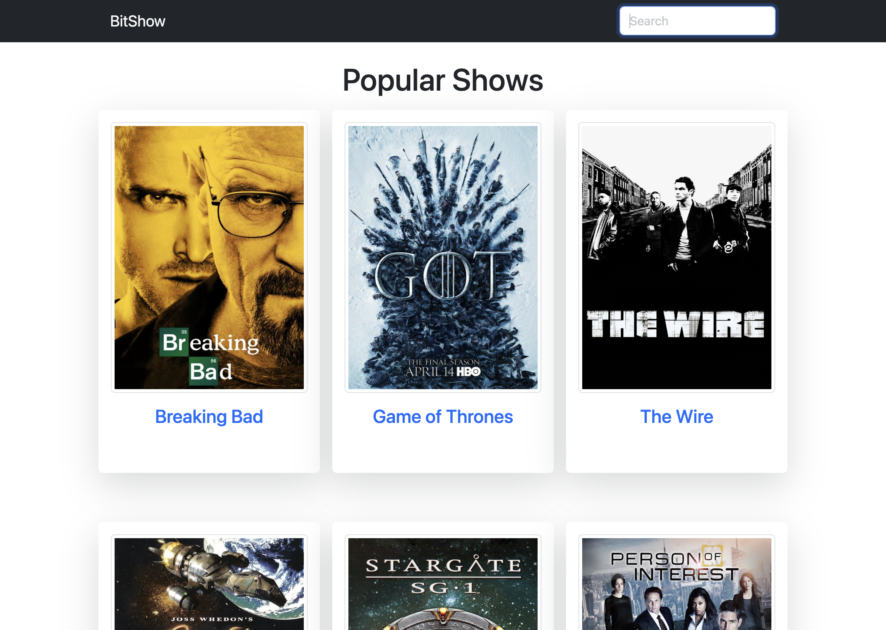

# Bit Show

## Description

Bit Show is a single-page web application that allows users to browse and search TV shows, and view their details. The application uses the TVmaze API to fetch data about TV shows.

### Features

- Show the first 50 most popular TV shows on the landing page 
- Browse and search TV shows
- View TV show details 
- Show more details about a chosen show by selecting it from the landing page or     dropdown menu 
- Dropdown menu shows up to 10 popular shows at a time, but works for all popular shows, not just those displayed

### Technologies Used

- HTML
- Bootstrap
- CSS
- JavaScript
- Fetch API
- TVmaze API

### Deployment

The project is deployed and can be accessed [here](https://tijanamilenkovic-bit-show.netlify.app).

